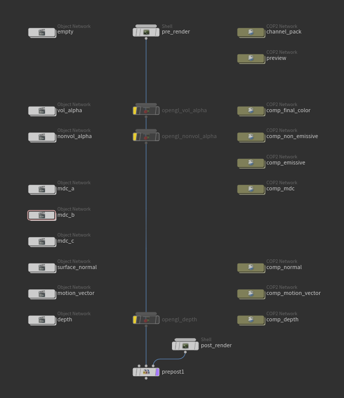

## What is a flipbook?
When we use high-quality, hard to simulate effects in videogames, most of what you see is usually "faked" through the use of flipbooks. Through the use of a single texture, several frames of the simulation are laid next to each other, ready to be extracted by the developer once it's inside the game engine. Once ready, each frame is shown in the order they were simulated and laid in the flipbook, creating the illusion of being simulated in real-time. Due to the nature of this technique, this means that FX created using flipbooks are completely flat (2D). Game developer usually fake this by creating a billboard with this texture, which is nothing more than a texture that is constantly looking at the camera plane.

|  |
|:--:|
| *example of a flipbook*|

## But isn't that extremely performance intensive?
It is indeed, and it's not only costly on the render side: it's also a problem with storage. High quality simulations tend to have lots of data, needing textures with a very high resolution in order to look convincing. Through this post we'll see a common technique of optimization, its results, and how to do it.

## Optimizing our flipbooks
The most obvious way to optimize our flipbooks is through two ways: reducing the resolution of the flipbook and using the least textures possible. But this comes with a huge quality drawback, as any VFX based in flipbook usage has to share the resolution of the texture between all of the frames. So, for a 2048x2048 flipbook with 64 frames, laid in a square of 8 frames per row and column (8x8), we would only have *2048/8 = 256* pixels available for each frame. We can just go and add more resolution, but that would only lead us to a bigger problem.

This is one the problems that *Mederic*, former VFX Tech Director of Skull & Bones, found while trying to have convincing explosions. [I'm basing this post on his explanation of this problem on Real-Time VFX forums](https://realtimevfx.com/t/smoke-lighting-and-texture-re-usability-in-skull-bones/5339).

### Motion-based vectors
So what do we do then? We can't just go ahead and delete frames randomly. Even though it would work, and we would achieve a higher resolution per frame, the result would just be a choppy mess that would hardly be identifiable as an explosion.

This is when the magic happens: *interpolation*

We can create another flipbook with the data of the motion in that pixel, or in other words: a flipbook storing the changes from one frame to the next. So... if we have this, we can just interpolate from one frame, to the next one, in the direction stored here, right? ABSOLUTELY!

Motion vector textures usually only pack data for the X and Y positions. This means that, for a texture, it only occupies two channels, usually the RG channels of a RGB/RGBA texture. This gives it its green-yellowish color.

|  |
|:--:|
| *Motion vector example*|

For the same explosion:
|   |  |
|---|---|
| 
*Frames without motion-based vectors*
 | 
*Frames with motion-based vectors*
 |

Using motion-based vectors we managed to go down from a 11x11 grid holding data for 121 frames, to a 6x6 grid with only 64 frames. This means close to double the resolution per frame.

|  |
|:--:|
| *Ingame view of 120 linear vs 64 interpolated*|

You might notice that 64 frames also looks darker. This leads us to the next section!

### Baked lighting for flipbooks: TLRB textures
By definition, a flipbook by itself would be impossible to lit correctly in a game scene, as after all it's only a plane with some color applied, and there isn't any volumetric smoke or simulation to lit.

To combat this, we introduce lighting maps. Lighting maps are just the same frames we had before, but with baked lighting data in it, rendered in the simulation software. For this, we render each frame once with a directional light pointing at it from different directions. This can be an infinite number of directions, but for performance purposes, I'm keeping it at 4 directions, as those are the channels we typycally use in a texture (R,G,B,A).

The original post by *Mederic* at VFX forums uses lights positioned at the *top, left, right and bottom* of the simulation volume. JangaFX, makers of the Embergen real-time simulation software also followed the same formula. So we're not gonna be less. For commodity purposes, we're gonna call this the *TLRB* texture from now on, according to the respective position of each direction in the texture. This is also how it's called inside Embergen.

|  |
|:--:|
| *Example of a TLRB texture*|

| 
*Top*
 | 
*Left*
 | 
*Right*
 | 
*Bottom*
 |
|---|---|---|---|
|   |  |   |  |
| 
*Red channel*
 | 
*Green channel*
 | 
*Blue channel*
 | 
*Alpha channel*
 |

### Emissive data
In order to achieve a better customization of our flipbook inside the game engine, it's better to not cache any data that isn't of the same type, or similar, together. This means that, for the explosion used as an example in this post, we want to differentiate between the explosion itself and the smoke it generates. This opens our way to change different parameters of the explosion once cached and in the game engine.

We can apply a blackbody based color ramp to this to give it any temperature inside the game engine. This gives us control of its color and intensity based on real-world properties, as well as the ability to change its hue, if we want to change its color from a natural one to a fantasy one (for example, if we want to represent magic).

|   |
|---|
|  |
| 
*Blackbody radiation ramps courtesy of Blender and Wikipedia*
 |

|  |
|:--:|
| *Personalized explosion with different value of temperature and hue* |

For this, we simply export the emissive data from our simulation. Both Embergen and Houdini support this, being relatively easy to export. More on this later on this post.

### Transparency data
Flipbook textures usually need more information on what's transparent, and to what extent. This is what makes parts of our smoke see-through where there is less density. For this, we also need to export the transparency data, usually called *alpha*. For this we only need a single channel, as the texture only holds data for what's visible or not.

|  |
|:--:|
| *Alpha channel example* |

### Overview
So we are aware now of all the parts of our textures. The only part left is assembling them together. Let's see what we have:
- A motion-based vector texture consisting on X and Y movements, occupying the R and G channels.
- A TLRB texture with 4 channels, one for each light.
- A channel for emissives in the simulation.
- A channel for transparency.

This totals up to 8 channels, or two RGBA textures... What a coincidence! It's almost as if we had thought of this on purpose.

We can arrange this in any way we want, but as we're aiming for Unreal Engine, the most useful way of packing it is as follows:

**Texture 1**
| Channel | Data |
|---|---|
| R | Motion Vectors **X**  |
| G | Motion Vectors **Y**  |
| B | Emissives             |
| A | Transparency/Alpha    |

**Texture 2 - TLRB texture**
| Channel | Data |
|---|---|
| R | **Top** lighting      |
| G | **Left** lighting     |
| B | **Right** lighting    |
| A | **Bottom** lighting   |

|   |  |
|---|---|
| 
*Example Texture 1*
 | 
*Example Texture 2*
 |

## Exporting this data ##
I will go through how to create these textures in the most commonly used fluid simulation software for game development at the moment - Embergen and Houdini. We will start with Embergen as the incredible, beautiful, godly, sigma team at JangaFX has prepared a tremendously easy way to export this kind of textures. Houdini is not too hard either, it's just rougher to work with, but SideFX has also prepared some things for this kind of exports.

### Embergen ###
Both of the textures presented are supported natively by Embergen. However, we do have to modify it to an extent in order to only use two textures.

|  |
|:--:|
| *Embergen export settings to achieve Texture1 and Texture 2 presented in this post* |


As of Embergen v1.0.5 (August, 2023), Embergen has a bug with how their TLR capture lays the data on the channels, as they've accidentally flipped Top and Right, making it RLT instead of TLR. The image above fixes this by flipping them back, shown in Six Point 1 (TLR).

It is possible that this might be fixed when you're following this post. Do not blindly follow the above image before checking.

You can check the state of this issue by checking the channels first or at [their Discord bug tracker](https://discord.com/channels/274382782627840002/1096854623467343975).


Embergen will create an output file for each capture. This is not a big problem, as we can just ignore them. I suggest naming them first to know which output files are the ones you want once exported.

### Houdini ###
Although we can create a relatively complex setup to achieve this, SideFX has us covered with their Labs node [_Labs Flipbook Textures_](https://sidefxlabs.artstation.com/projects/o2AX8k).

Houdini calls this MDC (Multidirectional Contributions), but it is the exact same procedure. It does have some differences in their implementation though, which will lead to a slightly different result when we're rendering using this method. We will also explore some ways to avoid this.

This node renders the explosion using the viewport, so you don't need to setup any renderers like Mantra or similar. It does need a _pyrobakevolume_ node on our volume setup in our /obj/ network. So first of all, we need to make sure that we have one ready.

|  |
|:--:|
| *An example explosion setup with a Pyro Bake Volume node ready* |

Once ready, back in our /out/ network, we can deploy a _Labs Flipbook Textures_ node and set it up accordingly. We will only need to render some passes, so even if you can choose to render what you want, I find it easier to just remove what we're not using from the setup. We also need to change how the node is compositing our textures.

|   |  |
|---|---|
| 
*Main setup*
 | 
*Export setup*
 |

Using the default MDC has a slight problem though: Houdini doesn't lay their lights how we're expecting. Their method has been designed to contain more lights, so their lights are setup in different direction, going around the volume in small increments. This means that our lights will all be slightly moved, as there are no lights in a purely top/left/right/bottom direction, which might be noticeable ingame if we're using Embergen generated flipbooks along with Houdini. Even if we aren't, the results won't be as consistent as they could be, as the lighting in the volume won't be 100% accurate. We can still use this and it will look alright inside Unreal, as it will interpolate between the other lights and not be very noticeable, but we will fix this editing the _Labs Flipbook_ Node by right clicking on it and pressing _Allow editing of contents in locked node_.

|   |
|:--:|
| 
*Allow editing of contents in locked node*
 |

Once unlocked, we will be able to get into the node. What we are going to do is basically changing the light directions in order to achieve the result we want. This will allow us to render the textures easily and have only one material back in Unreal for Embergen or Houdini generated textures.

|   |
|:--:|
| 
*Inside the Texture Flipbook Labs node*
 |

What we want to edit is inside the Object Networks _mdc\_a_ and _mdc\_b_. The settings should go as follows:

|network|name|x rot|y rot|z rot|
|--|--|--|--|--|
|mdc_a|mdc0 (red)|-90|0|0|
|mdc_a|mdc1 (green)|0|-90|0|
|mdc_a|mdc2 (blue)|0|90|0|
|--|--|--|--|--|
|mdc_b|mdc0 (red)|90|0|0|

The directions in the table are set accordingly to the TLRB paradigm we've set through this post. Red is top, green is left, etc. The red light in _mdc\_b_ will end up in the alpha channel of the final texture.

All lights should be parented with the camera, as it comes by default. Keep the color as it is. Remove the spare light in _mdc\_b_ and keep only the red one.

|   |  |
|---|---|
| 
*mdc_a*
 | 
*mdc_b*
 |

Now we can press _Render_ in our _Labs Texture Flipbook_ node, wait for the render and then export the textures from the export tab in the _Labs Texture Flipbook_ node settings.

## Using this inside Unreal Engine 5
There is an infinite number of ways of dealing with this inside Unreal, but there are a few keypoints:

- Using 4 light points, you need to estimate the result for the front and back lighting yourself.
- For motion vectors, the easiest way of dealing with motion vectors is by using Unreal Engine's _Flipbook Motion Vectors_ node. You can try implementing it yourself but this works great.
- You'll need to estimate where the light is in relation to the flipbook render.

Completely explaining how to do this inside Unreal would take ages and it wouldn't be as easy to understand as seeing it yourself, so here is a material that takes into account the textures we've just created. You can navigate it freely from here. You can copy and paste this into a material inside Unreal, as if it was the Unreal editor, and it will work without problems. I suggest that you check it out on fullscreen or at [blueprintUE](https://blueprintue.com/blueprint/jy42s0mu/), where you will also be able to copy it easily.

<iframe style="width:120%; height:600px;overflow:auto;" src="https://blueprintue.com/render/jy42s0mu/" scrolling="no" allowfullscreen></iframe>

This material will react to the directional light set in the scene by lighting up the flipbook render according to the baked lights rendered in Embergen/Houdini. It will also interpolate between the frames using the motion based texture we created.

## Overview
Feel free to drop a comment down below if you need any assistance or just want to say hi! I really hope this helped you. I've tried it to keep the performance and memory overhead to the bare minimum, but this technique has infinite ways of implementing it, depending on your necessities. The good thing about this is that we can achieve greater levels of detail in the flipbook by assigning more pixels per frame, as well as having the adequate parameters to reuse the explosion if needed. This is useful for fire simulations, for example, as they can be reused as smoke sprites or clouds without the need of having another flipbook explicitly created just for it.